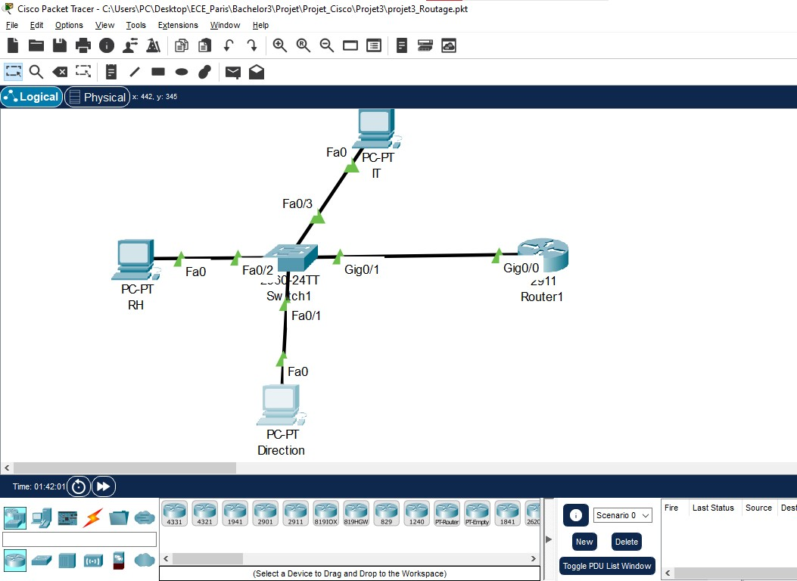

# 🧱 Projet 3 – Routage inter-VLAN sur routeur Cisco (Router-on-a-Stick)

## 🧩 Description

Ce projet s’inscrit dans le cadre de mon **challenge “30 Cisco Projects”**.  
Il représente la **suite logique du Projet 2**, où j’avais déjà mis en place la segmentation réseau avec les VLANs et une ACL de sécurité.  
Ici, l’objectif est de **formaliser et approfondir le routage inter-VLAN** afin de comprendre **comment un routeur Cisco assure la communication entre plusieurs VLANs** dans un réseau d’entreprise.

Ce projet m’a permis de consolider mes connaissances sur le **Router-on-a-Stick**, les **sous-interfaces**, l’**encapsulation 802.1Q**, et la **logique de routage entre sous-réseaux**.

---

## 🧠 Objectifs du projet

- Démontrer le fonctionnement du **routage inter-VLAN** sur un routeur Cisco.  
- Vérifier la **communication entre VLANs** via des pings croisés.  
- Comprendre l’importance du **trunk 802.1Q** et du rôle de chaque **sous-interface**.  
- Observer les **tables de routage et d’interfaces** sur le routeur.  
- Confirmer l’efficacité de l’**ACL du Projet 2** bloquant RH → IT.  
- Produire une documentation complète et claire (captures + analyse).

---

## 🧭 Topologie réseau

### Architecture

Le réseau utilisé ici est identique à celui du Projet 2 :
- 🖥️ **3 PC** représentant les services : Direction, RH et IT  
- 🧩 **1 Switch Cisco 2960**  
- 🌐 **1 Routeur Cisco 2911**

### Schéma logique


---

### Plan d’adressage

| VLAN | Département | Réseau /24      | Passerelle   | IP Exemple    |
| ---- | ------------ | --------------- | ------------ | ------------- |
| 10   | Direction    | 192.168.10.0/24 | 192.168.10.1 | 192.168.10.10 |
| 20   | RH           | 192.168.20.0/24 | 192.168.20.1 | 192.168.20.10 |
| 30   | IT           | 192.168.30.0/24 | 192.168.30.1 | 192.168.30.10 |

---

## ⚙️ Étapes de configuration

### 1️⃣ Vérification des VLANs existants
J’ai confirmé la présence des trois VLANs créés lors du Projet 2 :

```bash
Switch# show vlan brief
````

📸 *Capture :* [ShowVLAN_Brief.jpg](./captures/ShowVLAN_Brief.jpg)

---

### 2️⃣ Vérification du trunk entre le switch et le routeur

Le port **GigabitEthernet0/1** est bien en mode **trunk** et transporte les VLANs 10, 20 et 30.

```bash
Switch# show interfaces trunk
```

📸 *Capture :* [ShowInterfaces_Trunk.jpg](./captures/ShowInterfaces_Trunk.jpg)

---

### 3️⃣ Configuration du routeur (Router-on-a-Stick)

Le routeur **Router1** a été configuré avec trois **sous-interfaces** :

* G0/0.10 → VLAN 10
* G0/0.20 → VLAN 20
* G0/0.30 → VLAN 30

Chaque sous-interface utilise l’encapsulation **dot1Q** correspondant à son VLAN.

```bash
Router(config)# interface g0/0.10
Router(config-subif)# encapsulation dot1Q 10
Router(config-subif)# ip address 192.168.10.1 255.255.255.0
Router(config)# interface g0/0.20
Router(config-subif)# encapsulation dot1Q 20
Router(config-subif)# ip address 192.168.20.1 255.255.255.0
Router(config)# interface g0/0.30
Router(config-subif)# encapsulation dot1Q 30
Router(config-subif)# ip address 192.168.30.1 255.255.255.0
```

---

### 4️⃣ Vérification des interfaces et du routage

Pour s’assurer du bon fonctionnement :

```bash
Router# show ip interface brief
Router# show ip route
```

📸 *Captures :*

* [ShowIPInterfaceBrief_R1.jpg](./captures/ShowIPInterfaceBrief_R1.jpg)
* [ShowIPRoute_R1.jpg](./captures/ShowIPRoute_R1.jpg)

On observe que les interfaces G0/0.10, .20 et .30 sont **UP/UP**, et les routes locales sont bien enregistrées.

---

### 5️⃣ Vérification de l’ACL (héritée du Projet 2)

J’ai conservé l’ACL permettant de **bloquer le VLAN RH (20)** vers **le VLAN IT (30)** :

```bash
Router# show access-lists
```

📸 *Capture :* [ShowAccessLists.jpg](./captures/ShowAccessLists.jpg)

Cette ACL empêche tout trafic du sous-réseau 192.168.20.0/24 vers 192.168.30.0/24.

---

### 6️⃣ Tests de connectivité

#### ✅ Ping depuis **Direction** vers **RH** et **IT**

Les pings passent sans problème :
📸 *Capture :* [Ping_Direction_to_RH_IT.jpg](./captures/Ping_Direction_to_RH_IT.jpg)

#### 🚫 Ping depuis **RH** vers **IT**

Le trafic est bien bloqué par l’ACL :
📸 *Capture :* [Ping_RH_to_IT_blocked_if_ACL.jpg](./captures/Ping_RH_to_IT_blocked_if_ACL.jpg)

---

## 🧩 Analyse du fonctionnement

Ce projet m’a permis d’observer **en détail la logique du Router-on-a-Stick** :

* Chaque VLAN est un **sous-réseau distinct**, isolé sur le switch.
* Le **trunk 802.1Q** transporte toutes les trames VLAN jusqu’au routeur.
* Le routeur agit comme une **passerelle commune** entre les VLANs via ses sous-interfaces.
* Les **tables de routage** montrent bien les sous-réseaux connectés directement.
* Enfin, l’ACL prouve qu’il est possible d’appliquer une **politique de sécurité sélective** même dans un routage inter-VLAN.

---

## ⚠️ Difficultés rencontrées

Durant ce projet, j’ai eu à surmonter plusieurs points :

* ❌ **Trunk non fonctionnel** : j’avais oublié de définir les VLANs autorisés.
* ⚙️ **ACL mal appliquée** (sens “out” au lieu de “in”), ce qui bloquait tout le trafic.
* 🧩 **Sous-interface inactive** à cause d’un `no shutdown` oublié sur l’interface physique G0/0.

Ces erreurs m’ont aidé à mieux comprendre **le cheminement des paquets** et la **logique d’encapsulation dot1Q** entre le switch et le routeur.

---

## ✅ Résultats finaux

* Les VLANs 10, 20 et 30 communiquent via le routeur.
* Le **routage inter-VLAN est pleinement opérationnel**.
* L’**ACL** protège efficacement le VLAN IT contre les accès non autorisés.
* Toutes les configurations ont été sauvegardées et vérifiées.

---

## 🧠 Compétences acquises

* Compréhension complète du **Router-on-a-Stick**
* Configuration d’un **routage inter-VLAN** sur Cisco 2911
* Analyse du **trunk 802.1Q** et du **tag VLAN**
* Utilisation des **commandes de diagnostic** (show, ping)
* Dépannage et correction d’erreurs de routage
* Rédaction technique professionnelle

---

## 🗂️ Structure du projet

```
Projet3-InterVLAN-Router/
├── captures/
│   ├── Ping_Direction_to_RH_IT.jpg
│   ├── Ping_RH_to_IT_blocked_if_ACL.jpg
│   ├── Schema_Logique.jpg
│   ├── ShowAccessLists.jpg
│   ├── ShowInterfaces_Trunk.jpg
│   ├── ShowIPInterfaceBrief_R1.jpg
│   ├── ShowIPRoute_R1.jpg
│   └── ShowVLAN_Brief.jpg
├── configurations/
│   ├── R1_running-config.txt
│   └── SW1_running-config.txt
├── projet3_intervlan_router.pkt
└── README.md
```

---

## 👤 Auteur
**Dylan CHRIIST BEBEY NZEKE**  
🎓 Étudiant en Bachelor 3 – Administration d’infrastructure sécurisée (ECE Paris)  
📍 Paris, France  
🔗 [LinkedIn](https://www.linkedin.com/in/dylan-bebey-012886330/)  
📧 [dylanchriist@gmail.com](mailto:dylanchriist@gmail.com)

---

## 🚀 Prochain projet

Le **Projet 4** portera sur la **mise en place d’un serveur DHCP Cisco**, afin d’automatiser la distribution d’adresses IP dans les différents VLANs.
Cette étape marquera une **transition vers la gestion dynamique des adresses** et la simplification de l’administration réseau.

Souhaites-tu maintenant que je te crée le **post LinkedIn** (dans le style du projet 2) pour annoncer officiellement ton **Projet 3** avec le lien GitHub ?
